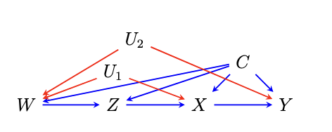

This package is built for estimating the Average Causal Effect (ACE) in the Napkin graphical model. This package is an implementation of the proposed estimators by Guo et al., 2025, based on the theory of influence functions and targeted minimum loss based estimation (TMLE). 

If you find this package useful, please cite:

```
@article{guo2025causal,
  title={Causal Inference with the Napkin Graph},
  author={Guo, Anna and Liu, Lin and Benkeser, David and Nabi, Razieh},
  journal={arXiv preprint arXiv:2512.19861},
  year={2025}
}
```

## Overview

`napkincausal` estimates average counterfactual outcomes and average causal
effects in the Napkin graph. The main user-facing function is `napkin_est()`,
which returns targeted minimum loss-based estimators (TMLE), one-step
estimators, and, when applicable, estimating-equation estimators.

The package supports binary or continuous outcomes, binary or continuous `Z`,
user-specified intervention densities for continuous `Z`, SuperLearner nuisance
estimation, and optional cross-fitting. When baseline covariates are supplied
through `covariates`, `napkin_est()` uses the covariate-adjusted estimator.

## Installation

You can install the development version from a local copy of the package:

```{r eval=FALSE}
install.packages("remotes") # If you have not installed "remotes" package
remotes::install_github("annaguo-bios/napkincausal")
```

Then load the package:

```{r eval=T}
library(napkincausal)
```

## Basic Usage

The core arguments are:

- `x`: treatment level, or `c(1, 0)` for an average causal effect.
- `data`: a data frame containing the observed variables.
- `treatment`: treatment variable name.
- `Z.variables`: mediator/intervention variable name.
- `W.variables`: parent variable name for `Z`.
- `outcome`: outcome variable name.



For example, to estimate `E(Y(1))` using one of the included example datasets:

```{r eval=T, warning=F}
data(data_Zbinary_Ycontinuous)

fit <- napkin_est(
  x = 1,
  data = data_Zbinary_Ycontinuous,
  treatment = "X",
  Z.variables = "Z",
  W.variables = "W",
  outcome = "Y",
  formula.Y = "Y ~ .",
  formula.X = "X ~ .",
  formula.Z = "Z ~ .",
  verbose = FALSE
)

```

To estimate an average causal effect comparing `x = 1` to `x = 0`, pass
`x = c(1, 0)`:

```{r eval=T, warning=F}
ace_fit <- napkin_est(
  x = c(1, 0),
  data = data_Zbinary_Ycontinuous,
  treatment = "X",
  Z.variables = "Z",
  W.variables = "W",
  outcome = "Y",
  verbose = FALSE
)
```

## Continuous Z

When `Z` is continuous, provide an intervention density through `z.density`.
The example below uses a uniform intervention density:

```{r eval=FALSE, warning=F}
data(data_Zcontinuous_Ycontinuous)

z_density <- function(z) dunif(z, min = -1, max = 1)

fit_continuous_z <- napkin_est(
  x = 1,
  data = data_Zcontinuous_Ycontinuous,
  treatment = "X",
  Z.variables = "Z",
  W.variables = "W",
  outcome = "Y",
  z.density = z_density,
  z_w.method = "dnorm",
  minZ = -1,
  maxZ = 1,
  verbose = FALSE
)

```

## Using Covariates

If baseline covariates should be adjusted for, pass their names through
`covariates`. In the current covariate-adjusted implementation, `W.variables`
should name a single binary `W` variable.

```{r eval=FALSE}
fit_covariates <- napkin_est(
  x = 1,
  data = analysis_data,
  treatment = "X",
  Z.variables = "Z",
  W.variables = "W",
  covariates = c("C1", "C2"),
  outcome = "Y",
  formula.Y = "Y ~ .",
  formula.X = "X ~ .",
  formula.Z = "Z ~ .",
  formula.W = "W ~ .",
  verbose = FALSE
)
```

## SuperLearner and Cross-Fitting

Set `superlearner.Y`, `superlearner.X`, and `superlearner.Z` to `TRUE` to use
SuperLearner for nuisance estimation. Use `crossfit = TRUE` to fit nuisances
with cross-fitting.

```{r eval=FALSE}
fit_sl <- napkin_est(
  x = 1,
  data = data_Zbinary_Ycontinuous,
  treatment = "X",
  Z.variables = "Z",
  W.variables = "W",
  outcome = "Y",
  superlearner.Y = TRUE,
  superlearner.X = TRUE,
  superlearner.Z = TRUE,
  crossfit = TRUE,
  K = 5,
  lib.Y = c("SL.glm", "SL.mean"),
  lib.X = c("SL.glm", "SL.mean"),
  lib.Z = c("SL.glm", "SL.mean"),
  verbose = FALSE
)
```
